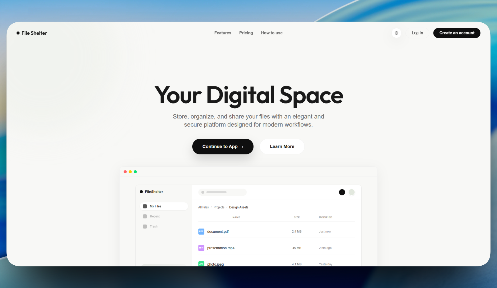
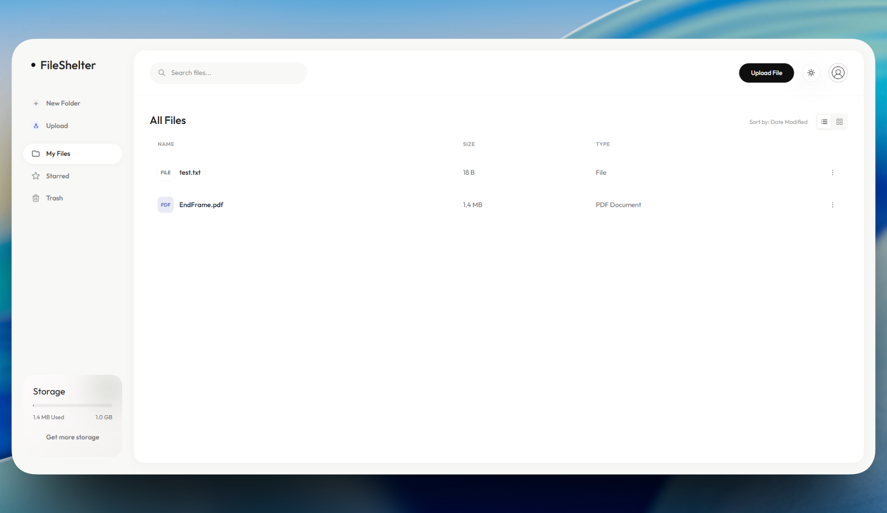

# File Shelter

A full-stack cloud storage platform built with Node.js, Express, MongoDB, and React — featuring AWS S3 storage, CloudFront CDN delivery, Google OAuth, role-based access control, and Razorpay subscription billing.

🔗 **Live:** [fileshelter.app](https://fileshelter.app)

---



---

## Features

- **File Management** — Upload, download, delete, and rename files and folders with structured error handling
- **Google OAuth** — Server-side ID token verification using Google Auth Library, preventing client-side forgery
- **AWS S3 + CloudFront** — Bucket-based file storage with CDN delivery for low-latency access
- **Hierarchical Storage** — Nested folder structure with efficient directory traversal via optimized MongoDB schema
- **Role-Based Access Control** — Four-tier RBAC (Owner, Admin, Manager, User) enforced at middleware level
- **Subscription Billing** — Razorpay-powered Pro and Premium tiers with webhook-driven lifecycle management and mid-cycle cancellations

---

## Tech Stack

| Layer        | Technology                |
| ------------ | ------------------------- |
| Frontend     | React.js, TailwindCSS     |
| Backend      | Node.js, Express.js       |
| Database     | MongoDB, Mongoose         |
| Auth         | Google OAuth 2.0, JWT     |
| Storage      | AWS S3, Amazon CloudFront |
| Payments     | Razorpay                  |
| Architecture | MVC, REST API             |

```
client/          → React frontend
server/
├── config/      → DB, AWS, environment configuration
├── controllers/ → Business logic and request handlers
├── middlewares/ → Auth, RBAC, validation middleware
├── models/      → MongoDB schemas
├── routes/      → API route definitions
├── services/    → Reusable service layer (S3, payment, etc.)
├── validators/  → Request validation logic
└── app.js       → Express app entry point
```

---



---

## Getting Started

### Prerequisites

- Node.js v18+
- MongoDB
- AWS account (S3 + CloudFront)
- Google OAuth credentials
- Razorpay account

### Installation

```bash
# Clone the repo
git clone https://github.com/saaahilhussain/virtual-file-system.git
cd virtual-file-system

# Install server dependencies
cd server && npm install

# Install client dependencies
cd ../client && npm install
```

### Environment Variables

Create a `.env` file in `/server`:

```env
MONGO_URI=your_mongodb_uri
JWT_SECRET=your_jwt_secret
GOOGLE_CLIENT_ID=your_google_client_id
AWS_ACCESS_KEY_ID=your_aws_key
AWS_SECRET_ACCESS_KEY=your_aws_secret
AWS_BUCKET_NAME=your_bucket
CLOUDFRONT_URL=your_cloudfront_url
RAZORPAY_KEY_ID=your_razorpay_key
RAZORPAY_SECRET=your_razorpay_secret
```

### Run

```bash
# Start backend
cd server && npm run dev

# Start frontend
cd client && npm run dev
```

---

## Author

**Sahil Hussain** — [LinkedIn](https://www.linkedin.com/in/sahil-hussain-146466285/) · [GitHub](https://github.com/saaahilhussain)
