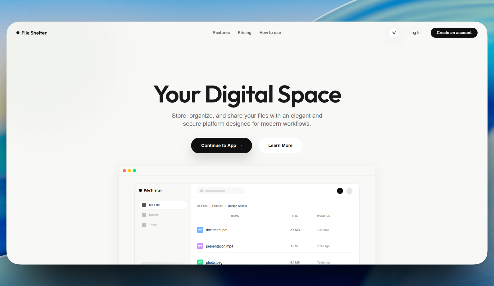
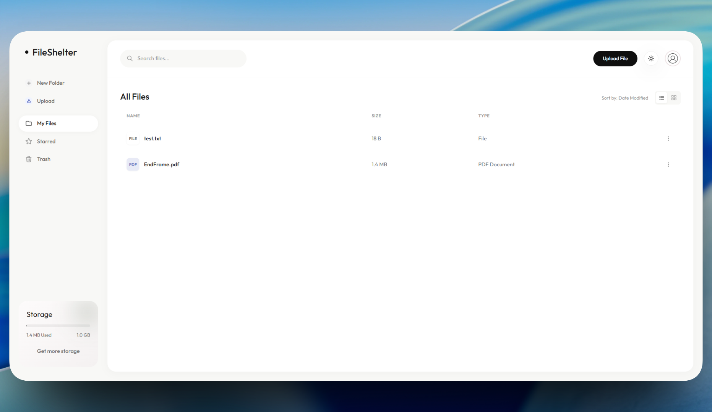

# File Shelter

A full-stack cloud storage platform by Sahil Hussain, with nested folders,
direct uploads to S3, signed CloudFront downloads, sharing, and Razorpay billing.

**Live:** [fileshelter.app](https://fileshelter.app)



## Architecture

| Layer | Implementation |
| --- | --- |
| Client | React 18, Vite 6, React Router 7, TailwindCSS 4; local state and fetch |
| API | Node.js 24, Express 4, ESM; routes, controllers and shared services |
| Metadata | MongoDB replica set, Mongoose 9, transactions and cursor pagination |
| Sessions | Signed, HttpOnly `sid` cookie; session JSON and expiry in Redis |
| Storage | Presigned S3 PUT uploads; signed CloudFront URLs for reads |
| Billing | Razorpay subscriptions; current-state sync, event ledger and atomic quota updates |
| Email / identity | Resend OTP email; local credentials, Google and GitHub sign-in |

Login creates a server-side session at `session:<sid>`. The browser sends its
signed cookie with `credentials: "include"`; middleware reads the Redis session
and attaches the account and role to the request. Cookies use `SameSite=Lax` and
become `Secure` in production. Authentication uses sessions rather than JWT
bearer tokens. A legacy MongoDB Session model remains in the repository; Redis
is the authoritative store for authentication and administrative revocation.

File bytes go directly from the browser to S3. The API first reserves quota in
MongoDB, then verifies the uploaded object's size before committing completion
and all ancestor folder sizes together. Pending uploads consume quota;
trashed files do not consume active quota. Completion retries reuse the same
file ID, so a lost acknowledgement does not require another transfer.
Permanent deletion queues S3 cleanup transactionally; the maintenance loop
retries deletion and expires abandoned uploads.

Administrative roles are lowercase `user`, `manager`, `admin`, and `owner`.
Permission middleware and controller hierarchy checks restrict user management;
file and directory queries are scoped to their owning account. Share links
support public or email-restricted access. The free quota is 1 GiB; Pro and
Premium plan mappings grant 200 GiB and 2 TiB respectively.

```text
client/src/
  apis/          Fetch API calls
  hooks/         Upload lifecycle and completion recovery
  components/    Shared UI
  pages/         Route screens
server/
  app.js         Express app (importable by tests)
  server.js      Connections, listener, maintenance and shutdown
  config/        Database, Redis, S3, roles and plans
  controllers/   HTTP workflows
  services/      Account transactions, storage, billing, sessions and providers
  models/        Metadata, billing events and durable cleanup records
  tests/         Integration and AWS SDK tests
```

## Upload failure and recovery

The actual Drive UI below receives a scripted HTTP 503 on its first completion
request. Clicking **Retry completion** confirms the same reservation without
initiating or transferring the file again. The recording uses local mocked
network responses, including an illustrative 100-byte quota.


- [Demo walkthrough, reproduction and recording script](./docs/upload-recovery.md)
- [Case study: preventing concurrent uploads from exceeding quota](./server/docs/QUOTA_CONSISTENCY_CASE_STUDY.md)
- [Storage reliability and operational limits](./server/docs/STORAGE_RELIABILITY.md)
- [Billing reliability](./server/docs/BILLING_RELIABILITY.md)



## Run locally

Use Node.js 24 (matching CI), a MongoDB **replica set** or Atlas deployment, and
Redis with **JSON and Search** support. Plain Redis without these modules cannot
serve the session APIs. Full application flows also require S3/CloudFront,
Resend, OAuth and Razorpay configuration; automated tests use isolated doubles.

```bash
git clone https://github.com/saaahilhussain/virtual-file-system.git
cd virtual-file-system
npm ci --prefix server
npm ci --prefix client
```

Copy [server/.env.example](./server/.env.example) to `server/.env` and
[client/.env.example](./client/.env.example) to `client/.env`, then replace the
placeholders. Node loads the server environment with `--env-file=.env`; Vite
uses the client `VITE_*` values. Client values are public build-time settings.

| Server variable | Purpose |
| --- | --- |
| `PORT`, `NODE_ENV`, `CLIENT_URI` | API port, production cookie behavior and allowed frontend origin |
| `MONGODB_URI` | MongoDB replica-set connection string |
| `REDIS_URI`, `SESSION_SECRET` | Redis connection and signed-cookie secret |
| `AWS_REGION`, `S3_BUCKET` | Region and file bucket |
| `S3_PROFILE_ACCESS_ID`, `S3_PROFILE_ACCESS_SECRET` | Credentials read by the current S3 client |
| `CLOUDFRONT_DOMAIN`, `CLOUDFRONT_PUBLIC_ID`, `CLOUDFRONT_PRIVATE_KEY` | HTTPS distribution URL, key-pair ID and signing private key |
| `RESEND_API_KEY` | OTP mail; verify the sender domain used by `otpService.js` |
| `GOOGLE_CLIENT_ID` | Server verification of Google ID tokens |
| `GITHUB_CLIENT_ID`, `GITHUB_CLIENT_SECRET`, `GITHUB_REDIRECT_URI` | GitHub OAuth application and callback URL |
| `RZP_KEY_ID`, `RZP_KEY_SECRET`, `WEBHOOK_SECRET` | Razorpay API credentials and webhook signature secret |
| `RZP_PLAN_PRO_MONTHLY`, `RZP_PLAN_PRO_YEARLY`, `RZP_PLAN_PREMIUM_MONTHLY`, `RZP_PLAN_PREMIUM_YEARLY` | Allowlisted subscription plan IDs and quota mappings |

For a fresh Redis instance, create the session lookup index (replace the URL):

```bash
redis-cli -u redis://localhost:6379 FT.CREATE userIdIdx ON JSON PREFIX 1 session: SCHEMA '$.userId' AS userId TAG
```

Run these in separate terminals, from the indicated directories:

```bash
# server/
npm run server

# client/
npm run dev
```

The examples use `http://localhost:4000` for the API and
`http://localhost:5173` for the client. Keep `CLIENT_URI` aligned with the actual
Vite origin. S3 CORS must allow that origin's PUT requests and the headers used
by presigned uploads. Configure Razorpay's webhook at `/api/billing/webhook`.
The client and server plan IDs must match. For production, use HTTPS and an
origin arrangement compatible with `SameSite=Lax` cookies.

`npm run setup` in `server/` applies MongoDB `collMod` JSON Schema validators
to **existing collections**. Run it after initial collection creation; it is
not a replacement for provisioning the replica set or Redis index.

## Verification

```bash
# client/
npm test              # Vitest + Testing Library critical-flow tests
npm run test:watch
npm run build
npm run lint          # Existing repository-wide lint debt remains

# server/
npm test              # Vitest + Supertest + in-memory MongoDB replica set
```

Frontend tests exercise the real Drive page and API layer with mocked fetch
and XHR boundaries: upload progress and success, completion failure/retry,
lost responses, transfer failure, cancellation failure/retry, quota rejection,
duplicate selection, terminal errors, session expiry and cursor pagination.
The frontend deployment workflow runs them before building or publishing.

Backend tests cover authentication, roles, sharing, concurrent quota reservation,
transaction rollback, cleanup recovery, billing consistency, and S3 SDK behavior.
They use a real in-memory MongoDB replica set with Redis and provider doubles;
the first run may download MongoDB. Backend deployment is gated on those tests.
These checks do not certify production S3 CORS/IAM, live provider availability,
or scalability under production load.

For the recorded browser check, see [the demo instructions](./docs/upload-recovery.md).
Remaining reliability work and operational limits are documented in the linked
storage and billing notes.

## Author

**Sahil Hussain** — [LinkedIn](https://www.linkedin.com/in/sahil-hussain-146466285/) · [GitHub](https://github.com/saaahilhussain)
