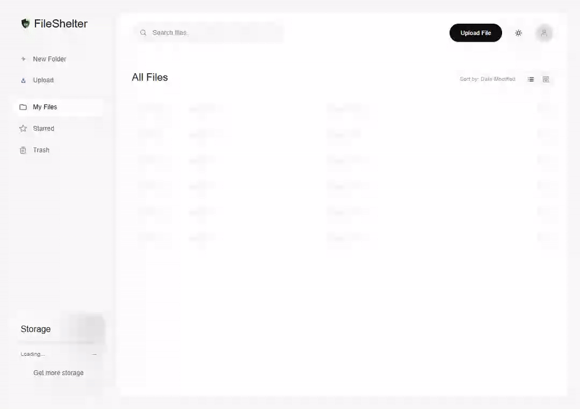

# Upload failure and recovery



This short recording shows the actual Drive page with deterministic mocked
network responses. The first completion request receives HTTP 503; the next
succeeds. It demonstrates browser recovery, rather than a live S3 outage.
The demo uses an 80-byte file and an illustrative 100-byte account quota.

## What happens

1. Select `recovery-demo.txt`. Initiation reserves its size and returns a file ID
   and PUT URL. The browser transfers the file once.
2. Completion fails with `S3 verification unavailable; retry completion`.
   The UI keeps the pending attempt visible and offers **Retry completion**
   or **Cancel upload**. A finished transfer is not reported as a completed file.
3. Click **Retry completion**. The browser sends the same `fileId` to the
   completion endpoint, without obtaining another PUT URL or resending bytes.
4. Successful acknowledgement refreshes the directory and storage summary.
   The file appears once and the pending status panel disappears.

The browser test asserts one initiation, one PUT, and two completion requests
carrying the same file ID. Backend tests independently verify that duplicate
completion does not count file sizes twice and that a verification failure
preserves the pending reservation.

## Reproduce and record

From `client/`, with Node.js 24:

```bash
npm ci
npx playwright install chromium
npm run demo:upload
```

The [demo configuration](../client/playwright.demo.config.js) starts a local Vite
server on `127.0.0.1:4175`. The [browser script](../client/e2e/upload-recovery.demo.js)
intercepts the demo API and storage requests; it needs no running backend,
provider credentials or production account. Its JSON fixtures and deliberate
recording pauses make the failure and recovery repeatable. The recorded WebM
is written beneath the ignored `client/demo-results/` directory.

To regenerate the GIF with FFmpeg, substitute the emitted video path and run
from the repository root:

```bash
ffmpeg -y -i client/demo-results/RECORDING_DIRECTORY/video.webm -vf "fps=6,scale=960:-1:flags=lanczos,split[s0][s1];[s0]palettegen[p];[s1][p]paletteuse" -loop 0 docs/demo/upload-recovery.gif
```

For quick checks without browser installation, run `npm test` in `client/`.

## Recovery boundaries

Completion retry remains available while the Drive page stays mounted. Reloading,
leaving the page, or session expiry loses the browser's pending attempt; there
is no persistent cross-session upload queue. The backend expires abandoned
reservations after 24 hours and queues object cleanup. Expiry processing runs
in bounded maintenance passes, so deletion is eventual rather than immediate.

Transfer errors show a message and a cancellation action. After acknowledged
cancellation, select the file again for a fresh transfer. Failed cancellation
keeps the attempt visible for another cancellation request. While initiation,
verification or cancellation is awaiting acknowledgement, conflicting actions
are unavailable. HTTP 400, 404 and 410 completion errors offer dismissal because
the file is invalid or its reservation is gone.

A lost completion response is ambiguous: the server may already have committed
success. Retrying completion resolves that ambiguity because the backend returns
success for an already-completed file. Cancellation can return HTTP 409 in that
case; the UI retains completion retry so the acknowledgement can be recovered.

See the [quota case study](../server/docs/QUOTA_CONSISTENCY_CASE_STUDY.md) and
[storage reliability notes](../server/docs/STORAGE_RELIABILITY.md) for the
transaction model, cleanup costs and provider verification limits.
